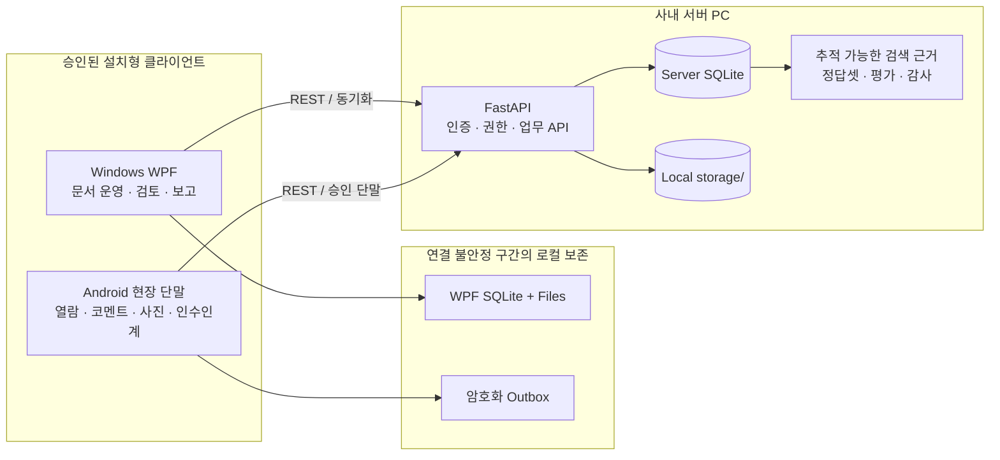

# FlowNote

> 생산현장의 **문서**와 **사람의 경험**을 하나의 추적 가능한 흐름으로 연결하는 온프레미스 시스템

FlowNote는 공장 내부 서버에서 문서 버전, 현장 공개본, 작업순서, 현장 코멘트, 사진, 인수인계와 보고서 근거를 함께 관리한다. 문서 보관에 그치지 않고, 현장에서 나온 판단과 문제 해결 경험을 다음 작업과 향후 AI 검색에 활용할 근거 데이터로 남기는 것이 목표다.

`FastAPI` · `Windows WPF` · `Android` · `SQLite` · `On-premises`

> **현재 상태:** 실제 운영 흐름을 구현하고 검증하는 연구 프로토타입이다. 아래 기능 설명은 2026-07-30 저장소 코드 기준이다. 운영 배포가 확정된 완제품은 아니다.

2026-07-28 `PILOT-20260728-1501-FULLPILOT-001`로 `full_pilot` 증거 구조를 새로 준비해 검증했다. 사전 승인, 고객 유사 장비, Windows·Android 실기, 별도 PC 복구, 역할별 현장 관찰, rollback과 운영·보안·현장 최종 승인이 제공되지 않아 `pilot-verification.json`은 미충족 조건 460건과 `FAIL`을 기록했다. 제품 실패를 관찰한 실행이 아니므로 화면이나 업무 흐름을 임의로 바꾸지 않았고 승인과 원시 증거가 준비될 때까지 운영 배포 판정은 `대기`다.

## 왜 만들었나

생산현장의 정보는 여러 곳에 흩어지기 쉽다.

- 작업표준서와 도면은 파일 서버에 있어도 어떤 버전이 현장 공개본인지 분명하지 않다.
- 작업 중 발견한 문제와 숙련자의 판단은 구두 전달이나 개인 메신저에만 남기 쉽다.
- 현장 기록을 보고서로 정리하는 과정에서 원문과 판단 근거의 연결이 끊긴다.
- 데이터가 쌓여도 출처와 권한이 분명하지 않으면 AI 검색과 조언에 안전하게 쓰기 어렵다.

FlowNote는 **문서 → 현장 사용 → 짧은 기록 → 관리자 검토 → 보고서 → 검색 근거**의 연결을 보존한다. MES나 ERP를 대체하지 않으며, 정형 생산 데이터만으로 담기 어려운 현장 맥락을 축적하는 계층을 지향한다.

## 현재의 핵심 연구 과제

FlowNote의 주요 기술 기능은 대부분 구현됐다. 하지만 생산현장용 제품의 완성은 기능 목록만으로 결정되지 않는다. 실제 작업자가 문서를 찾는 방식과 감각으로 판단하는 순간, 작업을 보류하거나 재작업하는 기준, 단말기가 놓이는 위치, 기록할 수 있는 시간은 현장마다 다르다.

FlowNote는 내부 기술 검증과 현장 사용성 검증을 구분해 진행한다. 내부 기술 검증에서는 API, Windows, Android의 테스트와 빌드, 정적 검사를 단계적으로 수행한다. 현재까지 확인한 항목은 통과했다. 현장 피드백을 기다리는 동안에도 내부 검증을 계속하고, 기능을 바꿀 때마다 검증 범위도 함께 넓힌다.

현장 사용성 검증은 실제 사용 과정에서 나오는 피드백을 조금씩 모으며 진행하고 있다. 의견이 한꺼번에 들어오지 않아 예상보다 더디지만, 검증은 계속되고 있다. 여러 사용자와 업무에서 반복되거나 실제 작업에 영향을 주는 피드백이 확인되면 개발 항목으로 전환해 기능, 입력 방식, 업무 흐름과 화면 구성에 적극 반영할 예정이다. 변경한 내용은 관련 테스트와 내부 검증 기준에도 함께 반영한다.

현장의 목소리는 한 번의 회의나 설문으로 한꺼번에 모을 수 없다. 공정, 설비, 작업조와 역할을 하나씩 돌아보며 실제 업무가 시작되고 멈추고 인계되는 과정을 따라가야 한다. 같은 작업도 작업자, 시간대, 설비 상태와 예외 상황에 따라 판단과 기록 방식이 달라진다. 짧은 방문에서 들은 의견만으로 전체 흐름을 일반화하기 어려운 이유다. 각 업무를 반복해서 관찰하고 서로 다른 목소리의 공통점과 차이를 확인하는 일이 이 연구에서 가장 오래 걸린다.

FlowNote의 장기 목표는 축적된 현장 데이터를 AI 검색과 의사결정 보조에 활용하는 데 있다. 하지만 최전선의 작업자가 시스템을 실제로 사용하지 않으면 데이터가 쌓이지 않아 연구 단계에 머문다. 근거가 쌓이지 않은 AI 기능만으로는 현장의 문제를 해결하거나 제품의 가치를 증명할 수 없다.

AI 기능을 앞세우는 것보다 작업자를 지속적으로 관찰하고, 실제 작업 중 사용할 수 있을 때까지 입력 방식과 업무 흐름을 다듬는 일이 먼저다. 현장 사용이 정착되고 문서와 경험이 자연스럽게 쌓여야 FlowNote의 AI도 근거 있는 검색과 조언으로 가장 큰 가치를 발휘한다.

1. 현장 관찰과 사용자 의견에서 실제 문제를 수집한다.
2. 의견을 `수용`, `불수용`, `추가 검토`로 분류하고 이유를 남긴다.
3. 문서, FieldComment, 작업순서, 인수인계와 보고서 흐름에 미치는 영향을 함께 검토한다.
4. 고객의 기존 문서 구조와 작업 방식을 불필요하게 바꾸지 않는 해결책을 설계한다.
5. 파일럿에서 다시 사용성을 확인하고 다음 구현에 반영한다.

이 프로젝트에서 코드는 해결책을 구현하는 수단이다. 장기적인 제품 품질은 현장의 암묵지와 불편을 얼마나 정확히 발견하고, 특정 개인의 요구가 아닌 반복 가능한 업무 구조로 바꾸는지에 달렸다.

## 동작 구조



- **Windows**는 관리자와 현장 PC의 문서 운영, 파일 감시, 검토, 보고서와 채널 감독을 담당한다. 로그인 역할별 첫 업무와 문서 검색·상태 필터를 제공한다. 권한 부족, 최신 revision 충돌과 동기화 미완료 오류는 실패 내용 → 보존 내용 → 처리 담당 → 지금 할 수 있는 일 순서로 안내한다.
- **Android**는 승인된 태블릿·러기드 단말의 공개 문서 열람, FieldComment, 사진, 신호등식 기록과 인수인계 작성·확인을 담당한다.
- **FastAPI 서버**는 계정·권한, 문서와 버전, 감사 로그, 작업순서, 채널, 보고서와 AI 근거 데이터의 권위 원천이다.
- 네트워크 오류가 업무 원천의 삭제로 이어지지 않도록 WPF와 Android가 각자의 범위에서 로컬 기록과 재시도 상태를 보존한다.

## 핵심 구현

### 1. 문서의 “최신본”과 “현장 공개본”을 분리

- 문서 상태: `WORKING`, `IN_REVIEW`, `PUBLISHED`, `ARCHIVED`
- 파일 등록, Drag & Drop, 버전 추가, 변경 사유와 태그
- TXT, PDF, XLSX, 이미지 미리보기
- 관리자가 선택한 버전만 현장 공개
- 열람 시작·종료와 다운로드 차단 이력, Windows 뷰어 수동 닫힘
- 허용 역할의 controlled copy: 세션에 묶인 1회성 티켓과 SHA-256 검증

### 2. 현장의 짧은 기록을 보고서 근거까지 연결

- 불변 원천인 `FieldComment`와 사진 첨부
- 신호등식 상태와 짧은 메모
- 담당자·기한·검토 단계·감사 이력
- 위험 신호·상충 기록의 분석자와 결정자 분리
- 다중 항목 검토 전 미리보기와 부분 성공 처리. 결과를 받은 뒤에는 성공 항목을 재전송하지 않고 실패 항목만 다시 선택한다.
- 현장 원문에서 보고서 초안·정제 문서까지 추적하고 조회 시 원천 권한 재검사
- 라인·설비·공정·오류 유형 등 태그 기반 연결

### 3. 불안정한 사내망을 전제로 한 동기화

- WPF 로컬 SQLite 우선 저장과 무손실 재시도 큐
- Android FieldComment·사진 첨부·인수인계 전용 SQLite outbox
- Android Keystore AES-GCM 기반 payload·첨부 보호
- idempotency key, aggregate revision과 mutation receipt
- stale revision을 자동 덮어쓰지 않는 충돌 처리
- 서버 instance·epoch·cursor 역행 감지와 관리자 승인형 재결합

### 4. 설치형 클라이언트 전체에 걸친 접근 통제

- 역할 기반 계정·권한과 활성 세션 폐기
- 서버 PC 1대의 단일 고객·현장 경계와 다른 scope 요청 차단
- 관리자 승인 단말만 Android 로그인 허용
- Android 문서 본문은 단기 1회 grant로 앱 내부에서만 열람
- 임시 파일 무결성 확인, `FLAG_SECURE`, 공유·외부 열기 차단
- 문서 수정자·열람자·코멘트 등록자·작업자 감사 추적

### 5. AI 호출보다 먼저 준비하는 근거 품질

- DB 원천에서 추적 가능한 검색 후보 재생성
- 제외 사유와 데이터 품질 지표
- 독립 2인 승인 ground-truth 사례
- 불변 dataset version과 오프라인 회귀 평가
- 실제 익명 현장 24칸 독립 표본 검토와 불일치 제3 합의를 보존하는 서버 API
- 외부 전송 승인, 프롬프트 수명주기, kill switch, 한도·보존·감사·legal hold

실제 외부 AI provider를 사용하는 사용자 검색·요약 화면은 아직 운영 범위에 포함되지 않는다. 외부 호출 경계는 기본 비활성 상태이며, 현재는 근거 데이터와 안전장치를 검증하는 단계다.

## 구성 요소

| 영역 | 역할 | 주요 기술 |
| --- | --- | --- |
| [`services/api`](./services/api) | 인증, 문서·버전, FieldComment, 작업순서, 채널, 보고서, 검색 근거 API | Python 3.11+, FastAPI, SQLAlchemy, SQLite |
| [`apps/windows`](./apps/windows) | 관리자·현장 PC용 문서 운영 및 검토 클라이언트 | .NET 10, WPF, SQLite |
| [`apps/android`](./apps/android) | 승인 현장 단말용 보안 열람 및 기록 클라이언트 | Java, Android SDK 35, SQLite, Android Keystore |
| [`docs`](./docs) | 제품, 아키텍처, 데이터 모델, API, 보안, 배포와 검증 기록 | Markdown |
| [`scripts`](./scripts) | 패키징, 누적 검증, 복구 비교와 파일럿 판정 보조 | PowerShell, Python, Shell |

## 현재 완성도

| 구분 | 상태 |
| --- | --- |
| FastAPI 업무 API와 SQLite 모델 | 구현됨 |
| Windows WPF 문서·검토·운영 화면 | 구현됨 |
| Android 현장 단말 최소 업무 흐름 | 구현됨 |
| 개별 내부 기술 검증 | 단계적으로 진행 중이며 현재까지 확인한 항목은 통과. 결과는 [검증 기록](./docs/verification.md)에 보존 |
| 현장 사용성 검증 | 피드백을 조금씩 수집하며 진행 중 |
| Windows 서버·WPF·Android 단일 실행 통합 기준선 | 대기 |
| 운영 코드 서명, MDM, 인증서와 현장별 설치 확정 | 대기 |
| 실제 외부 AI provider 운영 연동 | 후속 범위 |
| MES/ERP 어댑터 | 후속 범위 |

일반 브라우저 사용자 화면, 개인 휴대폰 기본 배포, 클라우드 운영, GPS·근태 관리와 개인 메신저 수집은 초기 제품 범위가 아니다.

## 내부 기술 검증 스냅샷

2026-07-30 현재 서버·Windows 컴포넌트와 Android 단위 테스트의 최신 확인 결과는 아래와 같다.

| 검증 대상 | 결과 |
| --- | --- |
| FastAPI OpenAPI | 루트 `GET /` 포함 132개 method/path |
| SQLAlchemy ORM | 60개 테이블 |
| FastAPI 테스트 | 160개 통과 |
| Python 정적 검사 | Ruff 통과 |
| WPF Core 테스트 | 84개 통과 |
| WPF 앱 빌드 | 경고 0개, 오류 0개 |
| Android 단위 테스트 | 24개 통과 |
| Android debug 빌드·lint | `assembleDebug`, `lintDebug` 통과 |

이 결과는 macOS ARM64 개발 호스트에서 실행한 API·Core 테스트, Windows 대상 교차 빌드, Android 개발 빌드를 기준으로 한다. 개별 내부 검증은 기능 개발과 함께 계속 진행한다. 실제 Windows UI 조작, 공통 누적 SQLite를 사용하는 Windows 통합 스모크, 승인 Android 실단말, 운영 HTTPS·코드 서명·MDM 검증을 한 실행 ID로 묶은 전체 구성요소 통합 기준선은 아직 `대기`다. 상세 실행 기록과 과거 실패 증거는 [검증 자동화 문서](./docs/verification.md)에 보존한다.

## 빠르게 살펴보기

### FastAPI 서버

Python 3.11 이상이 필요하다.

```powershell
cd services\api
py -3.11 -m venv .venv
.\.venv\Scripts\python.exe -m pip install -e .
Copy-Item .env.example .env
.\.venv\Scripts\python.exe -m uvicorn app.main:app --host 127.0.0.1 --port 5184 --reload
```

서버를 실행하면 다음 주소에서 상태와 OpenAPI 문서를 확인할 수 있다.

- Health: `http://127.0.0.1:5184/api/v1/health`
- Swagger UI: `http://127.0.0.1:5184/docs`

`.env.example`의 비밀값과 개발 기본 계정은 로컬 개발에만 사용한다. 실제 운영 환경에서는 현장별 비밀값, HTTPS, 접근 정책을 따로 설정해야 한다.

### Windows WPF

Windows와 .NET 10 SDK가 필요하다.

```powershell
$env:FLOWNOTE_API_BASE_URL = "http://127.0.0.1:5184"
dotnet run --project .\apps\windows\src\FlowNote.Windows.App\FlowNote.Windows.App.csproj
```

### Android

JDK와 Android SDK가 필요하다.

```bash
cd apps/android
./gradlew testDebugUnitTest
./gradlew assembleDebug
```

로그인 전에 FastAPI 서버 주소와 관리자가 등록한 승인 단말 `deviceId`를 입력해야 한다. 운영 배포는 조직 소유 키로 서명한 APK와 MDM 적용을 전제로 하며, debug APK는 운영에 사용하지 않는다.

## 검증

```powershell
# FastAPI
cd services\api
.\.venv\Scripts\python.exe -m pip install -e ".[dev]"
.\.venv\Scripts\python.exe -m pytest
.\.venv\Scripts\python.exe -m ruff check app tests

# Windows
cd ..\..
dotnet build .\apps\windows\src\FlowNote.Windows.App\FlowNote.Windows.App.csproj
dotnet test .\apps\windows\src\FlowNote.Windows.Core.Tests\FlowNote.Windows.Core.Tests.csproj
```

전체 Windows 기준선은 `scripts/verify-preserved-tests.ps1`로 FastAPI, WPF Core, Android 단위 테스트, 누적 SQLite 무결성과 스모크 증거를 하나의 실행 ID에 묶어 검증한다. 2026-07-30 현재 코드는 FastAPI 160건·WPF Core 84건·Android 24건이지만, 스크립트의 실제 고정값은 FastAPI 155건·WPF Core 84건·Android 24건이다. FastAPI 수집 단계 안내만 160건으로 표시되어 실행 조건과 안내가 서로 다르다. FastAPI 고정값과 안내를 현재 코드에 맞춘 뒤 Windows x64 수집 목록과 TRX `total/passed=84/84`, 누적 공통 DB 스모크와 Git 전후 점검을 포함한 무생략 실행을 같은 clean 소스 커밋에서 2회 통과해야 유효한 통합 기준선으로 판정한다.

| Windows x64 통합 기준선 | 첫 실행 | 재현 실행 |
| --- | --- | --- |
| 판정 | `대기` | `대기` |
| `run_id` | 없음 | 없음 |
| 요구 결과 | `partial_run=false`, `PASSED` | 같은 clean 소스 커밋에서 새 `run_id`로 동일 결과 |

실패 단계·기대값·실제값·중단 원인·다음 조치·보존 증거 경로는 콘솔과 실행별 `verification-summary.json`에 한글로 남긴다. 테스트 DB, 로그와 산출물은 회귀 분석 근거로 로컬에 계속 보존하되 Git에는 포함하지 않는다. 자세한 갱신·대조 절차는 [검증 자동화 문서](./docs/verification.md)를 따른다.

## 설계 문서

- [제품 개요](./docs/product-overview.md)
- [전체 시스템 관계](./docs/system-map.md)
- [데이터 모델](./docs/data-model.md)
- [API 계약](./docs/api.md)
- [보안 기준](./docs/security.md)
- [배포 기준](./docs/deployment.md)
- [검증 자동화와 실행 기록](./docs/verification.md)
- [중요 설계 결정](./docs/decisions.md)

## 프로젝트 원칙

- 고객이 사용하는 문서 구조를 존중하며 특정 트리나 BOM 구조를 강제하지 않는다.
- 업로드된 파일을 자동으로 최신 확정본으로 간주하지 않는다.
- 원천 현장 기록과 관리자가 정제한 보고서를 함께 보존한다.
- 네트워크·재시도·복구 실패에서도 업무 원천과 감사 이력을 잃지 않는다.
- AI 기능보다 출처, 권한, 데이터 품질과 회귀 평가를 먼저 준비한다.
- FlowNote는 MES나 ERP를 대체하지 않으며, 필요한 경우 후속 어댑터로 연결한다.

## 라이선스

현재 저장소에는 별도의 오픈소스 라이선스가 없다. 저장소 공개와 소프트웨어의 사용·수정·재배포 허용은 서로 다른 문제다. 외부 공개나 배포 전에 저장소 소유 조직이 `LICENSE`와 기여 정책을 확정해야 한다.
