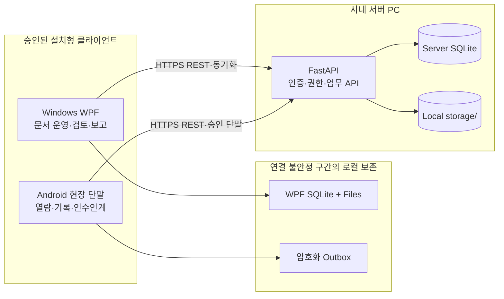

# FlowNote

> 생산현장의 문서와 사람의 경험을 하나의 추적 가능한 흐름으로 연결하는 온프레미스 연구 프로토타입

FlowNote는 공장 내부 서버에서 문서 버전, 현장 공개본, 작업순서, 현장 코멘트, 사진, 인수인계와 보고서 근거를 함께 관리한다. 문서를 보관하는 데서 끝내지 않고, 작업 중에 나온 판단과 문제 해결 경험을 다음 업무와 향후 AI 검색에 활용할 근거 데이터로 남기는 것이 목표다.

`FastAPI` · `Windows WPF` · `Android` · `SQLite` · `On-premises`

## 현재 기준

- 문서 기준일: **2026-08-15**
- 제품 단계: 현재 구현과 검증 결과를 공개 가능한 형태로 정리한 **연구개발 프로토타입**
- 연구개발 범위: **현재 기준선 정리 완료** — 소스, 설계, 매뉴얼과 서버 비의존 회귀 검증을 포함한다.
- 운영 배포: 연구 완료 조건이 아니다. 실제 도입에 필요한 설치·서명·MDM·복구 방법과 확인 항목만 문서로 제공한다.
- 공개 상태: 현재 작업 트리는 공개용 값과 제외 규칙을 적용했다. 라이선스 정책은 저장소 소유자의 별도 결정 범위다.
- UX 상태: 현재 화면과 메뉴를 기준으로 문서화했다. 이후 현장 관찰에 따라 정보 구조와 화면은 변경될 수 있다.

이 저장소는 기능 구현 결과와 실패·미검증 범위를 함께 보존한다. 구현됐다는 사실과 운영 배포가 승인됐다는 사실을 같은 의미로 사용하지 않는다.

## 해결하려는 문제

생산현장의 정보는 여러 곳에 흩어지기 쉽다.

- 작업표준서와 도면이 있어도 어떤 버전이 현장 공개본인지 분명하지 않다.
- 작업 중 발견한 문제와 숙련자의 판단이 구두 전달이나 개인 메신저에만 남는다.
- 현장 기록을 보고서로 정리하는 과정에서 원문과 판단 근거의 연결이 끊긴다.
- 출처와 권한이 불분명한 데이터는 향후 AI 검색과 조언에 안전하게 쓰기 어렵다.

FlowNote는 다음 연결을 보존한다.


FlowNote는 MES나 ERP를 대체하지 않는다. 정형 생산 데이터만으로 담기 어려운 현장 맥락을 문서와 연결해 축적하고, 필요한 경우 후속 어댑터로 기존 시스템과 연동하는 방향을 따른다.

## 실행 구조



- **FastAPI 서버**는 계정·권한, 문서와 버전, 감사 로그, 작업순서, 채널, 보고서와 AI 근거 데이터의 권위 원천이다.
- **Windows 앱**은 문서 등록과 검토·공개, 파일 감시, FieldComment 검토, 보고서, 계정·단말, 작업순서와 채널 운영을 담당한다.
- **Android 앱**은 승인된 태블릿·러기드 단말에서 공개 문서 열람, 오늘의 작업순서, FieldComment·사진, 알림과 인수인계를 담당한다.
- 네트워크 오류가 업무 원천 삭제로 이어지지 않도록 Windows와 Android가 각자의 범위에서 로컬 기록과 재시도 상태를 보존한다.

## 핵심 연구 결과

### 문서의 최신 버전과 현장 공개본 분리

- `WORKING`, `IN_REVIEW`, `PUBLISHED`, `ARCHIVED` 상태 구분
- 파일 등록, 버전 증가, 변경 사유와 태그 보존
- 최신 version·revision·file hash를 고정한 검토 요청과 승인 기반 공개
- 열람 시작·종료와 controlled copy 감사 추적
- Windows 뷰어는 사용자가 닫을 때까지 유지

### 현장 원문에서 보고서까지 추적

- 불변 원천인 `FieldComment`와 사진 첨부
- 녹색·황색·적색 신호와 짧은 메모
- 담당자·기한·검토 단계·감사 이력
- 위험 신호와 상충 기록의 분석자·결정자 분리
- 보고서 원천의 version·revision·hash 고정
- 확정 보고서 정정 시 원본을 덮어쓰지 않는 독립 정정 계열

### 불안정한 사내망을 전제로 한 보존

- WPF 로컬 SQLite 우선 저장과 무손실 재시도 큐
- Android FieldComment·사진·인수인계 암호화 outbox
- idempotency key, aggregate revision과 mutation receipt
- stale revision 자동 덮어쓰기 방지
- 서버 instance·epoch·cursor 역행 감지와 관리자 승인형 재결합

### 설치형 클라이언트 접근 통제

- 역할 기반 계정·권한과 활성 세션 폐기
- 서버 PC 한 대의 단일 고객·현장 경계
- 관리자 승인 Android 단말만 로그인 허용
- Android 문서 본문의 단기 1회 grant와 앱 내부 보안 열람
- 문서 수정자·열람자·코멘트 등록자·작업자 감사 추적

### AI 호출 전에 준비하는 근거 품질

- DB 원천에서 재생성할 수 있는 검색 후보
- 제외 사유와 데이터 품질 지표
- 독립 2인 승인 ground-truth와 불변 dataset version
- 실제 익명 현장 표본과 합성·시험 회귀 데이터의 분리
- 외부 전송 승인, 민감정보 정책, kill switch, 보존과 감사 제어면

실제 외부 AI provider를 사용하는 사용자 검색·요약 화면은 현재 운영 범위가 아니다. 외부 호출 경계는 기본 비활성 상태다.

## 구현 및 검증 상태

| 구분 | 현재 상태 |
| --- | --- |
| FastAPI 업무 API와 SQLite 모델 | 구현됨 |
| Windows WPF 문서·검토·운영 화면 | 구현됨 |
| Android 현장 단말 최소 업무 흐름 | 구현됨 |
| FastAPI 단위·회귀·정적 검사 | 2026-08-15 누적 DB·새 DB 기준 각각 209/209, Ruff 통과 |
| WPF Core 단위 테스트 | 2026-08-15 기준 120/120 통과 |
| WPF 앱 macOS 교차 빌드 | 2026-08-15 기준 경고 0, 오류 0 |
| Android 단위 테스트·개발 빌드·lint | 2026-08-15 강제 재실행 기준 39/39, build·lint 통과 |
| GitHub 자동 검증 | 공개 파일·문서, FastAPI, Windows WPF, Android 4개 job 구성 |
| 운영 HTTPS 서버 연동 스모크 | 2026-08-09 보존 기록 기준 통과 |
| Windows x64 무생략 통합 기준선 2회 | 실제 도입 시 선택 검증 |
| 승인 Android 실단말·MDM·코드 서명 | 실제 도입 시 선택 검증 |
| 고객 유사망·별도 PC 복구·제한 현장 파일럿 | 실제 도입 시 선택 검증 |
| 실제 외부 AI provider 운영 연동 | 후속 범위 |
| MES/ERP 어댑터 | 후속 범위 |

검증 수치는 실행 당시의 사실이다. 현재 소스의 새 완료 판정은 [검증 기록](./docs/verification.md)에 정의된 환경과 절차를 모두 충족한 실행만 인정한다.

## 빠르게 확인하기

처음 저장소를 받은 경우 [처음 실행하기](./docs/getting-started.md)에서 Git 제외 로컬 설정 생성, API 기동, health 확인과 클라이언트 연결 조건을 순서대로 확인한다. 자동 초기화 도구는 무작위 관리자 비밀번호와 토큰 비밀값을 만들며 기존 `.env`를 덮어쓰지 않는다.

### FastAPI 단위·회귀 검증

Python 3.11 이상이 필요하다. 아래 명령은 서버를 시작하지 않는 소스 회귀 검증이다.

```powershell
cd services\api
py -3.11 -m venv .venv
.\.venv\Scripts\python.exe -m pip install -e ".[dev]"
.\.venv\Scripts\python.exe -m pytest
.\.venv\Scripts\python.exe -m ruff check app tests
```

공개 소스의 로컬 API 평가는 [처음 실행하기](./docs/getting-started.md)에 따라 loopback에서 별도로 수행한다. 프로젝트의 운영 연동 확인은 승인된 HTTPS 서버를 사용하며 운영 DB·storage·로그와 자격 증명을 개발 PC로 복사하지 않는다.

### Windows WPF

Windows와 .NET 10 SDK가 필요하다.

```powershell
dotnet build .\apps\windows\src\FlowNote.Windows.App\FlowNote.Windows.App.csproj
dotnet test .\apps\windows\src\FlowNote.Windows.Core.Tests\FlowNote.Windows.Core.Tests.csproj
```

앱은 승인된 운영 HTTPS 주소로 로그인한다. `FLOWNOTE_API_BASE_URL` override도 HTTPS만 허용하며 HTTP와 localhost로 우회하지 않는다.

### Android

JDK 17과 Android SDK 35가 필요하다.

```bash
cd apps/android
./gradlew testDebugUnitTest
./gradlew assembleDebug
./gradlew lintDebug --warning-mode=fail
```

운영 배포는 조직 소유 키로 서명한 APK와 MDM 적용을 전제로 한다. debug APK는 운영에 사용하지 않는다.

## 문서 안내

| 독자 | 먼저 읽을 문서 |
| --- | --- |
| 처음 실행하는 개발자 | [처음 실행하기](./docs/getting-started.md) |
| 연구 책임자·검토자 | [연구 결과 정리](./docs/research-summary.md) |
| 제품·설계 검토자 | [제품 개요](./docs/product-overview.md), [시스템 맵](./docs/system-map.md) |
| 서버 운영자 | [서버 설치·운영 매뉴얼](./docs/manuals/server-operations.md) |
| Windows 사용자·관리자 | [Windows 사용 매뉴얼](./docs/manuals/windows-user-guide.md) |
| Android 현장 사용자 | [Android 현장 사용 매뉴얼](./docs/manuals/android-field-guide.md) |
| 장애 대응 담당자 | [공통 장애 대응](./docs/manuals/troubleshooting.md) |
| 개발·검증 담당자 | [API](./docs/api.md), [데이터 모델](./docs/data-model.md), [검증 기록](./docs/verification.md) |

전체 문서의 역할과 읽는 순서는 [문서 안내](./docs/README.md)에서 확인한다.

## 공개 범위

공개 저장소에는 소스 코드, 합성·회귀 테스트, 설계 문서, 역할별 매뉴얼과 값이 비어 있거나 예시로만 채워진 설정 파일을 둔다. 실제 고객 문서·현장 데이터, SQLite, 로그, 빌드 산출물, 서버 주소, 계정, 토큰, 인증서, 서명키와 비공개 승인 기록은 포함하지 않는다. 코드에 표시되는 `https://flownote.example`은 연결 대상이 아닌 예약 예시 주소다.

현재 작업 트리의 공개 경계와 공개 전 확인 항목은 [오픈소스 공개 기준](./docs/open-source-release.md), 취약점 제보 원칙은 [보안 정책](./SECURITY.md), 기여 준비 상태는 [기여 안내](./CONTRIBUTING.md)를 따른다.

## 저장소 구조

| 경로 | 역할 |
| --- | --- |
| [`services/api`](./services/api) | FastAPI 인증·문서·현장 기록·보고서·운영 API |
| [`apps/windows`](./apps/windows) | Windows WPF 관리자·현장 PC 클라이언트 |
| [`apps/android`](./apps/android) | Android 승인 현장 단말 클라이언트 |
| [`docs`](./docs) | 제품·설계·운영·검증·연구 문서 |
| [`scripts`](./scripts) | 패키징·누적 검증·복구·파일럿 판정 보조 도구 |

## 범위와 보안 원칙

- 고객이 사용하는 문서 구조를 존중하며 특정 트리나 BOM 구조를 강제하지 않는다.
- 업로드 파일을 자동으로 최신 확정본으로 간주하지 않는다.
- 원천 현장 기록과 관리자가 정제한 보고서를 함께 보존한다.
- 네트워크·재시도·복구 실패에서도 업무 원천과 감사 이력을 잃지 않는다.
- 일반 브라우저, 개인 휴대폰 기본 배포, GPS·근태 관리와 개인 메신저 수집은 초기 범위가 아니다.
- 비밀번호, 토큰, 인증서, 개인키, 실제 고객 문서와 운영 데이터는 저장소에 기록하지 않는다.
