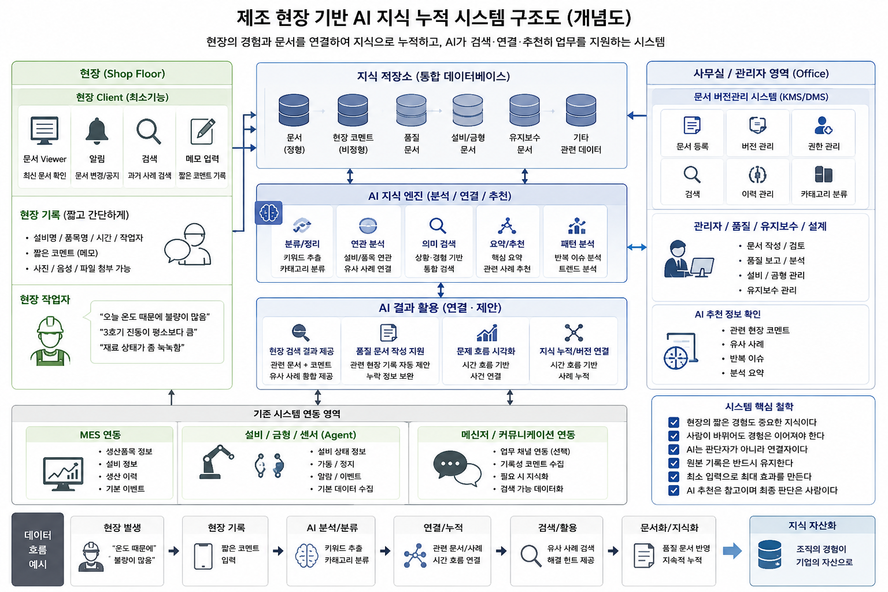

# FlowNote 소개서

## 1. 시스템 개요

FlowNote는 제조 현장의 기술문서, 도면, 매뉴얼, 작업지시서, 생산규격, 현장 코멘트, 작업 문제점, 관리자 보고서를 함께 관리하고, 향후 AI 검색과 작업 조언에 활용할 수 있도록 데이터를 축적하는 독립형 문서·현장지식 관리 서버이다.

기존 제조 시스템은 생산 실적, 품질 수치, 설비 데이터 등 정형 데이터 중심으로 운영되어 왔다. 하지만 실제 제조 현장에서는 작업자의 경험, 설비의 특성, 반복적으로 발생하는 문제의 흐름, 현장의 감각적인 판단 등 비정형 경험 데이터도 중요한 역할을 한다.

이러한 정보는 작업자의 기억, 메신저, 구두 전달 형태로만 남는 경우가 많다. 시간이 지나면 사라지거나 담당자의 퇴사, 이동, 장기 부재, 숙련자 은퇴로 인해 조직 내부에서 단절될 수 있다.

FlowNote는 이러한 문제를 해결하기 위해 다음을 목표로 한다.

- 현장의 짧은 경험과 감각 정보 기록
- 생산, 설비, 금형, 품질 관련 문서 통합 관리
- 문서 버전과 현장 공개 버전 관리
- AI 기반 문서 및 코멘트 연결
- 반복 문제 및 유사 사례 검색 지원
- 관리자 분석 보고서와 원천 코멘트 연결
- 장기적인 현장 지식 자산화
- 사람이 바뀌어도 현장의 경험이 조직의 지식으로 이어지는 구조 구축

## 1.1 개념 구조도

아래 구조도는 FlowNote가 현장 기록, 문서, 관리자 보고서, 기존 MES/ERP 및 설비 데이터를 어떻게 연결해 지식으로 누적하는지 보여준다.

> 이미지 파일 경로: `docs/00-introduction/images/flownote-concept-map.png`

## 2. 핵심 철학

### 2.1 현장의 지식은 정식 문서에만 존재하지 않는다

실제 제조 현장의 중요한 노하우는 다음과 같은 형태로 존재한다.

- 작업자의 짧은 코멘트
- 반복 경험
- 설비의 특성
- 품질 담당자의 판단
- 유지보수 경험
- 현장의 감각적인 표현

예시는 다음과 같다.

- "오늘 재료 상태가 좀 눅눅함"
- "3호기 진동이 평소보다 큼"
- "예전 불량 때와 비슷한 느낌"
- "오후부터 온도 흔들림 있음"

이러한 정보는 기존 시스템에서는 단순 메모 수준으로 사라질 가능성이 높지만, 실제 현장에서는 중요한 경험 데이터이다. FlowNote는 짧은 현장 언어와 감각 표현도 조직의 지식 자산으로 누적 관리하는 것을 목표로 한다.

### 2.2 사람이 바뀌어도 경험은 이어져야 한다

제조 현장에서는 특정 담당자의 경험과 감각에 의존하는 경우가 많다.

그러나 퇴사, 부서 이동, 장기 휴직, 숙련자 은퇴가 발생하면 현장의 경험도 함께 단절될 수 있다.

FlowNote는 작업자의 경험과 현장의 흐름을 조직의 지식으로 누적하여, 새로운 담당자도 과거 사례와 경험을 검색하고 참고할 수 있도록 한다.

> 사람의 기억에 의존하던 현장 경험을 조직의 지식으로 전환하는 시스템이다.

### 2.3 AI는 판단자가 아니라 연결자이다

FlowNote에서 AI는 다음을 수행하지 않는다.

- 품질 판정
- 생산 제어
- 책임 판단
- 강제 의사결정

AI의 역할은 다음과 같다.

- 문서 읽기
- 현장 코멘트 분석 보조
- 분류 제안
- 문서와 코멘트 연결
- 관련 자료 추천
- 요약
- 검색 보조
- 유사 사례 탐색
- 보고서 초안 작성 보조

즉 AI는 현장의 기억과 문서를 연결하여 사람이 더 빠르게 문제를 이해할 수 있도록 지원하는 지식 연결 엔진 역할을 수행한다.

AI가 제시하는 내용은 참고 자료이며, 최종 품질 판단과 생산 판단은 담당자의 검토를 기반으로 수행된다.

### 2.4 기존 업무 흐름을 최대한 유지한다

현장 시스템은 복잡하면 안 되고, 입력이 많으면 안 되며, 작업 흐름을 방해하면 안 된다.

따라서 FlowNote는 다음 방향을 지향한다.

- 기존 MES/ERP와 연동 가능한 경우 API로 보완 연동
- 기존 시스템을 대체하지 않고 문서와 현장 경험을 연결하는 보조 레이어로 동작
- 연동이 어려운 경우 최소 기능 기반 현장 클라이언트 제공
- 현장 작업자는 문서 열람, 알림 확인, 짧은 기록, 간단 검색 중심으로 사용

현장 사용자의 입력 동선은 최소화한다.

### 2.5 현장 기록은 최소 입력을 원칙으로 한다

실제 제조 현장에서는 복잡한 입력 구조나 긴 문서 작성은 지속적으로 유지되기 어렵다.

FlowNote는 다음과 같은 최소 입력 구조를 우선한다.

- 신호등식 기록
- 정형 문구 선택
- 짧은 문장
- 메모성 기록
- 관리자 대리 입력
- 후속 확장으로 음성 입력과 사진 첨부

분류와 연결은 AI가 보조한다.

> 작업자는 짧게 기록하고, AI는 이를 읽고 연결하여 지식으로 누적하는 구조를 목표로 한다.

### 2.6 원본 기록은 유지되어야 한다

현장 기록과 작업자 메모는 제조 현장의 실제 경험 데이터이므로 원본 자체가 중요하다.

따라서 AI가 문장을 정리하거나 요약하더라도 원본 기록은 수정하지 않고 유지한다.

AI는 다음을 수행할 수 있지만 원본 데이터를 변경하지 않는다.

- 분류 제안
- 요약
- 연결
- 추천
- 보고서 초안 보조

이를 통해 추적성, 감사 대응, 기록 신뢰성을 유지한다.

### 2.7 현장 기록의 신뢰도는 구분되어야 한다

현장 코멘트에는 추정, 느낌, 반복 경험이 포함될 수 있다. 따라서 모든 내용을 확정 정보로 처리하지 않는다.

FlowNote는 다음과 같은 신뢰도 또는 상태 구분을 고려한다.

- 현장 추정
- 반복 관찰
- 관리자 검토
- 품질 확인
- AI 연관 분석

예시는 다음과 같다.

- "온도 때문인 듯"
- "재료 상태 이상 가능성"
- "유사 사례 반복 발견"

이러한 정보는 확정 판단이 아니라 참고 정보 및 경험 데이터로 활용한다.

### 2.8 AI의 핵심 자산은 내부 문서와 경험 데이터이다

외부 AI는 일반 지식과 공개 정보는 제공할 수 있지만, 회사 고유의 설비 특성, 금형 특성, 품목 특성, 현장 경험, 품질 흐름까지 이해하기는 어렵다.

FlowNote는 다음 내부 데이터를 장기적으로 축적하여 AI 기반 내부 지식 자산으로 발전시키는 것을 목표로 한다.

- 정식 문서
- 문서 버전
- 품질 기록
- 유지보수 기록
- 현장 코멘트
- 관리자 분석 보고서
- 작업내역
- 반복 사례

### 2.9 데이터 주권은 고객에게 있어야 한다

FlowNote가 다루는 기술문서, 도면, 생산규격, 작업 보고서는 고객의 핵심 자산이다. 많은 제조 현장은 이러한 문서를 외부 클라우드에 저장하는 것을 꺼린다.

FlowNote는 사내 서버형 운영을 기준으로 한다. 초기 설치 방식은 고객 현장 또는 사내 서버 PC 1대와 클라이언트 설치파일 배포를 기본으로 한다.

중요한 기준은 고객이 데이터와 파일 저장 위치를 통제하고, 인가된 사용자만 접근하는 것이다.

## 3. 시스템 구성 개념

FlowNote는 크게 세 가지 흐름으로 구성된다.

### 3.1 문서 버전관리 시스템

문서 버전관리 시스템은 관리자 및 사무실 중심 영역이다.

주요 기능은 다음과 같다.

- 문서 등록
- 파일 첨부
- 카테고리 분류
- 태그 관리
- 권한 관리
- 검색 기능
- 변경 이력 관리
- 버전 관리
- 문서 상태 관리
- 현장 공개 버전 관리

관리 대상 문서는 다음과 같다.

- 품질 문서
- 설비 문서
- 금형 문서
- 유지보수 문서
- 작업 표준서
- 생산 관련 문서
- 관리자 보고서

문서 버전관리 시스템은 회사의 공식 지식을 관리하는 역할을 수행한다. 단, 업로드된 최신 파일이 항상 현장 공개 문서라는 뜻은 아니며, 작업중, 검토중, 현장 공개, 보관 상태를 구분한다.

### 3.2 현장 경험 및 코멘트 기록 시스템

현장 경험 및 코멘트 기록 시스템은 현장 작업자가 짧은 내용을 빠르게 기록할 수 있도록 돕는다.

기록 항목 예시는 다음과 같다.

- 설비명
- 생산품목명
- 라인
- 공정
- 시간
- 작업자 또는 작업그룹
- 현장 코멘트
- 관련 문서
- 관련 태그

입력 예시는 다음과 같다.

- "오늘 온도 때문인지 불량이 많음"
- "금형 상태가 조금 이상함"
- "오후부터 진동 증가"
- "재료 교체 후 안정됨"

특징은 다음과 같다.

- 짧은 문장 입력 중심
- 메모성 기록 허용
- 비정형 표현 허용
- 최소 입력 구조
- 작업 흐름 방해 최소화
- 원본 기록 보존
- 관리자 분석과 보고서화 연결

현장의 짧은 코멘트는 원천 이력으로 누적 관리한다. 코멘트만으로 확정 데이터가 되는 것은 아니며, 관리자급 사용자의 검토와 분석을 거쳐 보고서 형태의 정제 문서와 연결될 때 실제 활용성이 높아진다.

### 3.3 MES/ERP 및 설비 연동 구조

FlowNote는 MES/ERP를 대체하지 않는다.

MES/ERP와 연동 가능한 경우 다음 정보를 연결한다.

- 작업지시
- 생산품목명
- 공정 정보
- 설비 정보
- 기본 생산 이력
- 생산 실적

설비와 연결된 별도 에이전트 또는 연동 모듈은 후속 단계에서 다음 정보를 수집할 수 있다.

- 설비 가동 상태
- 기본 이벤트 정보
- 설비 이상 이벤트

단, FlowNote는 MES 자체를 대체하는 것이 아니라 현장 경험과 문서를 연결하기 위한 보조 레이어 역할을 수행한다.

라인, 공정, 설비, 품목 개념은 생산현장 맥락을 표현하기 위해 차용할 수 있지만, 고객별 용어와 운영 방식에 맞게 유연하게 매핑한다.

## 4. 현장 클라이언트 구조

현장 클라이언트는 복잡한 ERP형 구조가 아니라 다음 중심의 최소 기능 구조로 구성한다.

- Viewer
- 알림
- 검색
- 짧은 기록

FlowNote의 프론트엔드는 Windows WPF 기반 설치형 네이티브 클라이언트로 작성한다.

실제 현장 운영에서는 일반 브라우저 직접 접근보다 승인된 설치형 클라이언트 앱 접근을 기본으로 한다.

### 4.1 문서 Viewer 기능

현장 작업자는 현장 공개 상태의 문서를 빠르게 열람할 수 있다.

지원 대상은 다음과 같다.

- 작업 표준서
- 품질 공지
- 설비 문서
- 유지보수 문서
- 작업지시 관련 문서

특징은 다음과 같다.

- 현장 공개 버전 확인
- 단순 UI
- 빠른 열람
- 현장 친화적 구조
- 후속 클라이언트 앱 단계에서 뷰어 자동 닫힘과 다운로드 차단 적용

### 4.2 알림 기능

문서 변경 및 품질 관련 내용을 현장에 전달한다.

예시는 다음과 같다.

- 작업 표준서 변경
- 품질 기준 변경
- 설비 점검 공지
- 긴급 공지
- 현장 공개 문서 버전 변경

### 4.3 현장 검색 기능

작업자는 과거 사례 및 관련 경험을 검색할 수 있다.

예시는 다음과 같다.

> 예전에 비슷한 문제 있었나?

AI는 다음을 연결하여 제공할 수 있다.

- 관련 품질 문서
- 과거 코멘트
- 관리자 보고서
- 설비 기록
- 유지보수 기록
- 유사 사례

### 4.4 현장 메모 입력 기능

현장에서 즉시 짧은 기록을 남길 수 있다.

지원 기능은 다음과 같이 단계적으로 확장한다.

- 신호등식 기록
- 정형 문구 선택
- 한 줄 메모
- 설비 선택
- 품목 선택
- 공정 선택
- 관리자 대리 입력
- 후속 확장으로 사진 첨부
- 후속 확장으로 음성 입력

## 5. AI 기반 연결 및 분석 기능

AI는 다음 데이터를 함께 읽고 연결한다.

- 정식 문서
- 문서 버전
- 현장 메모
- 품질 문서
- 설비 기록
- 유지보수 기록
- 관리자 보고서
- 작업내역

### 5.1 AI 분류 제안 기능

AI는 현장 코멘트를 확정 분류하지 않고 분류를 제안한다.

기능은 다음과 같다.

- 키워드 추출
- 문장 정리
- 카테고리 분류 제안
- 설비/품목 연관 분석
- 유사 사례 연결
- 반복 키워드 분석
- 신뢰도 또는 상태 후보 제안

예시 원문은 다음과 같다.

> 오늘 온도인지 재료인지 불량이 많음

AI 정리 예시는 다음과 같다.

- 분류 후보: 품질 이상
- 관련 키워드: 온도, 재료, 불량
- 상태 후보: 원인 확인 필요
- 신뢰도: 현장 추정

### 5.2 관리자 보고서 연계 기능

관리자 또는 품질 담당자가 보고서를 작성할 때 AI는 관련 현장 기록을 제안할 수 있다.

예시는 다음과 같다.

- 생산 당시 온도 관련 코멘트 존재
- 동일 설비 진동 관련 기록 존재
- 유사 품목 과거 사례 존재
- 같은 공정에서 반복된 문제점 존재

이를 통해 관리자 보고서와 현장 경험이 연결된다.

AI는 보고서를 대신 확정하지 않는다. AI는 원천 코멘트, 작업내역, 관련 문서, 태그를 바탕으로 보고서 초안을 보조하고, 최종 보고서는 관리자급 사용자가 검토하고 확정한다.

### 5.3 AI 기반 통합 검색 기능

기존 검색은 파일명, 제목, 카테고리 중심이었다.

FlowNote는 다음 검색을 지향한다.

- 의미 기반 검색
- 상황 기반 검색
- 경험 기반 검색
- 태그 기반 검색
- 작업 흐름 기반 검색

예시는 다음과 같다.

> A품목에서 온도 관련 문제 있었나?

AI는 다음을 함께 제공할 수 있다.

- 품질 문서
- 현장 코멘트
- 관리자 보고서
- 설비 기록
- 유지보수 문서
- 유사 사례

### 5.4 지식 누적 및 버전 연결 기능

AI는 시간 흐름 기반으로 관련 기록을 연결하고 누적할 수 있다.

예시 흐름은 다음과 같다.

생산 시점:

> 오늘 재료 상태 이상함

검수 단계:

> 표면 불량 증가 확인

품질 분석:

> 재료 수분 영향 가능성 존재

AI 누적 정리:

> 동일 품목에서 재료 상태 관련 사례 반복 발생

이 흐름에서 원천 코멘트, 관리자 분석, 최종 보고서, 관련 문서 버전은 서로 연결되어야 한다.

## 6. 기대 효과

### 6.1 현장 측면

- 작업 경험 보존
- 현장 노하우 축적
- 반복 문제 검색 가능
- 신규 작업자 적응 지원
- 문서 열람과 코멘트 등록의 접근성 향상

### 6.2 품질 및 관리자 측면

- 품질 문서 보완
- 관리자 보고서 작성 보조
- 과거 사례 참고 가능
- 현장 경험 반영 가능
- 문제 원인 분석 시 근거 확보

### 6.3 기업 측면

- 암묵지 자산화
- 조직 지식 축적
- 담당자 변경 시 경험 단절 최소화
- 고객 데이터 주권 유지
- 장기적 AI 기반 구축 가능

## 7. 장기 발전 방향

### 7.1 초기 단계

- 문서 저장
- 문서 버전 관리
- 현장 공개 버전 관리
- 현장 코멘트 기록
- 태그 기반 관계 보완
- 기본 검색 및 연결

### 7.2 중기 단계

- 유사 사례 자동 연결
- 반복 패턴 분석
- AI 분류 제안 고도화
- 관리자 보고서 초안 보조
- Windows WPF 클라이언트 고도화
- MES/ERP 연동 확장

### 7.3 장기 단계

- 해결 사례 추천
- 문제 흐름 예측
- AI 기반 현장 조언 기능
- 반복 문제 사전 감지 지원
- 생산 이력 기반 의사결정 조언

장기 단계는 충분한 데이터 누적과 양질의 현장 기록이 축적된 이후 단계적으로 발전 가능하다.

## 8. 최종 목표

FlowNote의 최종 목적은 다음과 같다.

> 제조 현장의 암묵지와 경험을 문서와 함께 AI 기반으로 연결·누적하여, 사람이 바뀌어도 현장의 기억이 조직의 지식으로 계속 이어질 수 있도록 하는 것.

## 9. 개발 방향에 대한 생각

제조 현장의 중요한 경험은 항상 정식 문서로 남지 않는다.

작업자의 짧은 말, 설비의 느낌, 반복적으로 겪은 경험과 같은 현장의 감각은 시간이 지나면 사람과 함께 사라지는 경우가 많다.

FlowNote는 단순한 문서관리나 AI 기능 추가를 목표로 하지 않는다.

현장의 경험과 흐름을 장기적으로 누적하고 연결하여, 사람이 바뀌어도 조직의 기억이 이어질 수 있는 구조를 만드는 것을 목표로 한다.

AI는 판단자가 아니라, 흩어진 경험과 문서를 연결하여 사람이 더 빠르게 이해하고 찾을 수 있도록 돕는 연결 도구에 가깝다.

미래에는 AI 자체보다, 얼마나 많은 현장 경험과 흐름을 지속적으로 축적해 왔는지가 제조 현장의 중요한 경쟁력이 될 수 있다.
