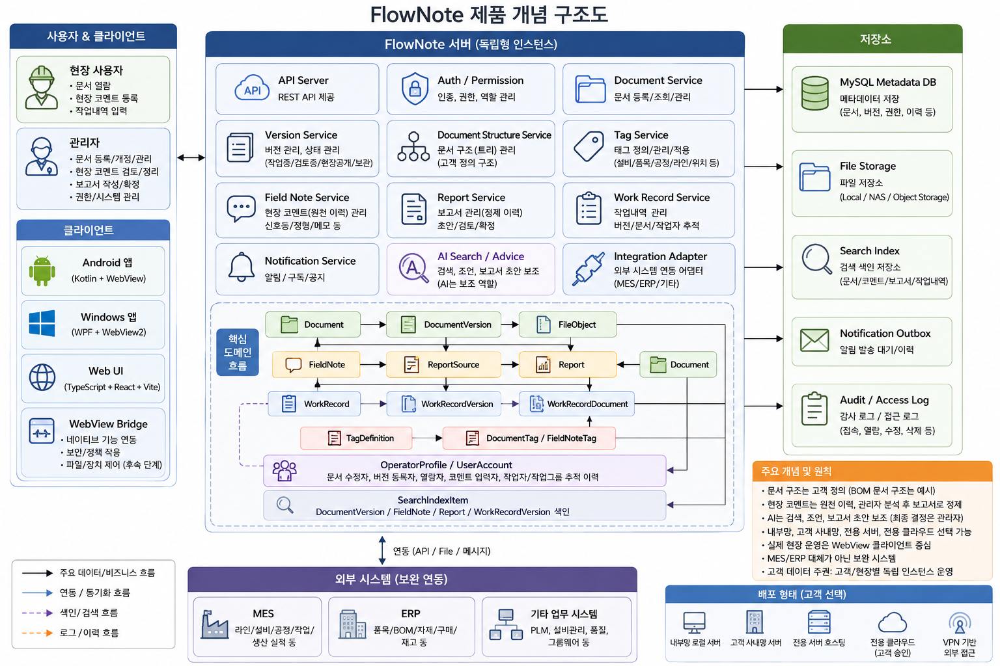

# FlowNote 아키텍처

## 1. 전체 구조

FlowNote는 Python FastAPI 기반 문서·현장지식 관리 서버를 중심으로 WPF 또는 Avalonia 네이티브 클라이언트, 외부 시스템이 REST API로 연결되는 구조이다. 독립 Web UI는 신규 개발 대상에서 제외한다.

아키텍처의 핵심은 문서관리와 지식관리 중 한쪽으로 치우치지 않는 것이다. 문서 서비스는 최신본, 버전, 권한, 이력을 안정적으로 관리하고, 현장지식 서비스는 문서와 작업 맥락에 연결된 코멘트와 문제점을 축적한다. AI는 이 데이터를 검색하고 조언하기 위한 활용 계층으로 두며, 장기적으로 의사결정 보조까지 확장할 수 있게 한다.

FlowNote는 MES/ERP의 대체 시스템이 아니다. 초기 작업지시와 업무 구조는 관리자가 직접 입력하고 고객이 이미 사용하는 문서 정리 구조에 연결한다. 기존 MES/ERP가 있으면 후속 단계에서 정형 생산 데이터를 연동할 수 있게 확장하고, FlowNote는 문서, 현장 노하우, 관리자 보고서, 작업 맥락을 연결해 AI가 활용할 수 있는 데이터를 보강한다.

문서 구조는 프로그램이 강제하지 않는다. 트리 구조와 현장 용어의 BOM 문서 구조는 지원 가능한 예시이며, 고객이 이미 가진 정리 방식을 바꾸지 않고 흡수하는 것이 우선이다.

## 1.1 FlowNote 제품 개념 구조도

아래 구조도는 FlowNote의 사용자/클라이언트, 서버 모듈, 핵심 도메인 흐름, 저장소, 외부 시스템 연동, 배포 형태를 한눈에 보여준다.



> 이미지 파일 경로: `docs/images/flownote-product-concept-architecture.png`

```text
Native Client (WPF or Avalonia)
  -> Field Document Viewer
  -> Explorer-style Search
  -> Field Comment
  -> Work Sequence / TV View
  -> Admin Console
  -> File Watch Support
  -> Version Upload Assist
  -> Work Sequence Management
  -> AI Search / Advice

External Systems
  -> FlowNote REST API
  -> MES / ERP Integration Adapter

FlowNote Python FastAPI Server
  -> SQLite Metadata DB
  -> Local Storage Folder
  -> Search Index
  -> Notification Outbox
```

WPF/Avalonia 클라이언트를 기본으로 하는 이유는 현장 테스트와 배포를 단순하게 만들기 위해서이다. 서버 PC 1대에 FastAPI 서버, SQLite DB, 로컬 storage 폴더를 두고, 현장 PC에는 클라이언트 설치파일을 배포한다. 일반 브라우저 접속은 기본 사용 방식으로 두지 않는다. 문서 미리보기 계층은 필요 시 앱 내부에 제한적으로 포함할 수 있지만, 공통 Web SPA를 개발하지 않는다.

## 2. 도메인 관계

상세 도메인 상관관계는 [상관관계 정리](./system-map.md)를 기준으로 한다.

```text
Document
  -> DocumentVersion
    -> FileObject

DocumentStructure
  -> DocumentStructureItem
    -> DocumentStructureItemDocument
      -> Document / DocumentVersion

Document
  -> FieldNote
    -> CommentTemplate
    -> ReportSource
      -> Report

Document
  -> WorkRecordDocument
    -> WorkRecord
      -> WorkRecordVersion

DocumentVersion / FieldNote / WorkRecordVersion
  -> SearchIndexItem
  -> AI Search / Advice
```

핵심 원칙은 문서 파일, 문서 메타데이터, 버전, 현장 코멘트, 작업내역, 보고서를 같은 테이블에 섞지 않는 것이다. 서로 연결하되 각자의 생명주기를 분리한다. 문서 증거, 현장 경험, 작업 맥락, 관리자 분석 보고서의 연결 관계가 향후 AI 기능의 데이터 기반이 된다.

## 3. 서버 모듈

### 3.1 API Layer

- 외부 시스템, 현장 단말기, 관리자 단말기 요청을 받는다.
- 인증, 권한, 입력 검증, 공통 오류 응답을 처리한다.
- API 버전은 `/api/v1` 경로를 사용한다.

### 3.2 Document Service

- 문서 메타데이터를 관리한다.
- 문서 상태를 관리한다.
- 최근 등록 버전과 현장 공개 버전을 분리해서 제공한다.
- 문서 삭제는 상태 변경으로 처리한다.

### 3.3 Document Structure Service

- 고객 정의 문서 구조를 관리한다.
- 프로그램이 기본 구조를 제시하거나 강제하지 않는다.
- 트리형, 목록형, 프로젝트형, 작업지시서형, 현장 용어의 BOM 문서 구조 등을 유연하게 표현할 수 있게 한다.
- 구조 항목에 문서 또는 특정 문서 버전을 연결한다.
- 초기 작업지시서 구조는 관리자가 직접 생성한다.
- 추후 MES/ERP 연동 시 외부 프로젝트, 작업지시서, 품목, 공정 데이터를 고객 정의 구조에 매핑할 수 있게 한다.

### 3.4 External Integration Service

- 기존 MES/ERP와 연동하기 위한 현장별 어댑터를 관리한다.
- 작업지시, 품목, 공정, 설비, 생산실적 같은 정형 데이터를 수집한다.
- 외부 시스템의 원본 식별자와 FlowNote 내부 문서 구조, 작업내역, 현장 코멘트를 매핑한다.
- 외부 시스템의 원본 데이터를 임의로 대체하지 않고 참조 관계를 유지한다.
- 현재 단계에서는 작업지시 자동 수신이 아니라 관리자 입력 구조를 기준으로 한다.

### 3.5 Version Service

- 새 문서 버전을 생성한다.
- 변경 사유, 등록자, 등록일, 파일 정보를 기록한다.
- 최근 등록 버전과 현장 공개 버전 변경 후 이력과 알림 이벤트를 생성한다.

### 3.6 Local Storage Adapter

- 서버 PC의 로컬 storage 폴더를 파일 저장소로 사용한다.
- NAS, 오브젝트 스토리지 확장은 후속 선택지로 둔다.
- 파일 크기, MIME 타입, 확장자, 해시값을 기록한다.
- HWP, Word, PowerPoint, Excel, PDF, DWG 등 다양한 형식을 저장 대상으로 처리한다.

### 3.7 Terminal Support Service

- 단말기 모드를 관리한다.
- `viewer` 모드는 현장 공개 문서 열람, 알림, 코멘트 등록을 제공한다.
- `admin_support` 모드는 지정 파일 변경 감지와 업로드 후보 생성을 지원한다.
- 클라이언트 앱은 WPF 또는 Avalonia로 동작한다.
- 앱의 로컬 기능은 권한과 단말기 모드에 따라 제한한다.
- 운영 환경에서는 일반 브라우저 직접 접근보다 승인된 설치형 클라이언트 앱 접근을 기본으로 한다.

### 3.8 Notification Service

- 문서 버전 상승, 현장 사진 기록 등록, 작업순서 변경 같은 이벤트를 알림으로 변환한다.
- 초기에는 DB 기반 알림 목록 조회 방식으로 시작할 수 있다.
- 이후 WebSocket, FCM, 내부 푸시 서버로 확장할 수 있다.

### 3.9 Field Note Service

- 현장 코멘트, 작업 평가, 문제점을 관리한다.
- 문서와 문서 버전에 연결한다.
- 원문, 관리자 정리 문구, 관리자 분석 내용을 분리한다.
- 코멘트 입력자와 실제 전달자 또는 작업자를 구분해 기록한다.
- 초기에는 신호등식 상태, 정형 문구 선택, 짧은 자유 입력, 관리자 대리 입력을 우선 저장한다.
- 실시간 작업자 입력을 강제하지 않고, 현장 안착 이후 MES 연동이나 자동화 입력으로 확장한다.

### 3.10 Comment Template Service

- 정형 문구 템플릿을 관리한다.
- 문서 유형, 공정, 설비, 위치, 카테고리 기준으로 필터링할 수 있다.

### 3.11 Tag Service

- 설비, 품목, 공정, 오류 유형, 라인, 위치, 사용자 정의 태그를 관리한다.
- 문서와 현장 코멘트에 태그를 연결한다.
- 고객 정의 문서 구조로 표현되지 못한 관계를 태그로 보완한다.
- 태그는 검색, 보고서, AI 조언의 관계 확장에 사용한다.

### 3.12 Report Service

- 선택된 현장 코멘트, 작업내역, 관련 문서로 보고서 초안을 만든다.
- AI는 관리자급 사용자의 보고서 초안 작성을 보조한다.
- 최종 보고서는 관리자 검토 후 FlowNote 문서로 저장한다.
- 보고서에 사용된 원본 코멘트, 작업내역 버전, 관련 문서 버전을 추적한다.
- 난잡한 원천 이력과 정제된 보고서를 함께 유지해 추적성과 활용성을 모두 확보한다.

### 3.13 Work Record Service

- 작업지시와 작업내역을 관리한다.
- 작업내역이 바뀌면 새 버전으로 남긴다.
- 작업지시 문서, 관련 문서, 현장 코멘트를 연결한다.
- 작업자, 작업반, 조장, 관리자 대리 등록자 같은 작업 참여 주체를 연결한다.
- 라인, 공정, 설비, 품목 같은 생산 맥락을 고객별 구조와 태그에 맞게 연결한다.

### 3.14 Work Sequence Service

- 사무실과 관리자급 사용자가 현장 처리 순서를 입력하고 조정한다.
- 작업순서 항목은 작업내역, 문서 구조 항목, 외부 작업지시 참조와 연결할 수 있다.
- 현장 TV 화면은 작업순서 항목을 라인, 공정, 설비, 작업반 기준으로 필터링해 표시한다.
- 반장, 조장, 관리자 권한으로 순서 변경, 보류, 진행중, 완료 상태를 기록한다.
- 순서 변경과 상태 변경은 이력과 알림 이벤트로 남긴다.
- MES가 작업 우선순위를 충분히 제공하지 못하는 현장에서는 FlowNote가 사무실 판단을 현장 실행 화면으로 전달하는 계층이 된다.

### 3.15 Basic Search Service

- 파일명, 문서명, 태그, 문서 구조, 작업지시 기준의 탐색기형 검색을 제공한다.
- 기본 검색은 AI 기능과 분리된 1차 체감 기능으로 둔다.
- PDF나 Office 문서의 본문 추출 검색은 후속 인덱싱 단계에서 확장한다.
- 검색 결과는 사용자가 열람 권한을 가진 문서, 사진 기록, 작업순서 항목만 표시한다.

### 3.16 AI Search / Advice Service

- 문서, 버전, 태그, 현장 코멘트, 보고서, 작업내역을 검색 인덱스에 반영한다.
- MES/ERP에서 연동된 정형 데이터와 FlowNote의 현장지식 데이터를 함께 참조한다.
- 자연어 기반 문서 검색을 제공한다.
- 작업지시 문서와 관련 자료를 분석하여 예상 문제와 주의 사항을 제시한다.
- 답변에는 가능한 경우 근거 문서, 버전, 코멘트, 작업내역을 포함한다.
- 권한이 없는 데이터는 검색과 조언에서 제외한다.
- 과거 생산 데이터 기반 신규 작업 설계나 자동 의사결정은 초기 범위가 아니며, 충분한 운영 데이터가 쌓인 뒤 검토한다.

### 3.17 Auth / Permission Service

- 회원 계정, 로그인 세션, 그룹, 역할 기반 권한을 관리한다.
- 현장 작업자 또는 작업그룹은 로그인 계정과 1:1로 같지 않을 수 있으므로 작업 주체 정보를 별도로 관리할 수 있게 한다.
- 현장 사용자는 문서 열람과 코멘트 등록 중심이다.
- 현장 사용자 다운로드 차단은 클라이언트 앱 단계에서 구현한다.
- 관리자는 문서 수정, 삭제, 버전 업로드, 권한 관리, 파일 감시를 수행할 수 있다.
- 문서 다운로드는 관리자급 권한에서만 허용한다.

### 3.18 Viewer Session Service

- 문서 뷰어 세션과 자동 닫힘은 클라이언트 앱 단계에서 구현한다.
- 자동 닫힘 기능은 클라이언트 앱에서 구현하고 서버에는 세션과 감사 로그를 기록한다.
- 클라이언트 앱 단계에서 자동 닫힘, 사용자 닫힘, 권한 실패를 접근 로그 또는 감사 로그로 남길 수 있다.

### 3.19 Legacy Document Import / Parsing Service

- 기존 문서 대장, 작업지시서, 관리 파일의 파싱을 지원한다.
- 고객이 이미 쓰던 정리 체계를 FlowNote 문서 구조와 태그로 전환하는 것을 돕는다.
- 이 기능은 1차 구현 범위가 아니며, 개발 단계는 추후 결정한다.

### 3.20 Audit / History Service

- 문서 변경 이력, 버전 추가, 상태 변경, 접근 로그를 기록한다.
- 문서 수정자, 버전 등록자, 문서 열람자, 현장 코멘트 등록자, 실제 전달자 또는 작업자를 추적한다.
- 사진 기록 등록자, 작업순서 변경자, 작업순서 상태 변경자도 추적한다.
- 파일 감시 후보 처리와 AI 조언 요청도 필요 시 감사 대상으로 기록한다.
- 외부 시스템 연동 수신/동기화 실패도 감사 또는 운영 로그 대상으로 둔다.
- 로그인, 다운로드, 뷰어 자동 닫힘 같은 보안 이벤트도 기록 대상으로 둔다.

## 4. 핵심 흐름

### 4.1 문서 개정

```text
관리자
  -> 새 파일 선택
  -> 변경 사유 입력
  -> DocumentVersion 생성
  -> latest_version_id 갱신
  -> 필요 시 published_version_id 갱신
  -> DocumentHistory 기록
  -> Notification 생성
  -> 현장 단말기 알림 확인
```

### 4.2 관리자 파일 감시

```text
WPF/Avalonia Client
  -> 관리자 UI
  -> 감시 대상 파일 등록
  -> 로컬 파일 감시 기능 호출
  -> 파일 상태 스냅샷 저장
  -> 수정 시간 / 크기 / 해시 비교
  -> 변경 후보 생성
  -> 관리자가 업로드 확정
  -> 문서 새 버전 등록
```

파일 감시는 변경 감지까지만 담당한다. 자동 개정은 하지 않는다.

### 4.3 앱 로컬 기능 연동

```text
Client App UI
  -> Local Action Request
  -> Native App Function
  -> Local Control / File Watch / OS Notification
  -> API Server Audit / Result Sync
  -> Client App State Update
```

앱 로컬 기능은 서버가 직접 접근할 수 없는 단말기 기능만 수행한다. 문서 파일을 단말기에 자동 동기화하는 용도로 사용하지 않는다.

### 4.4 현장 코멘트

```text
현장 사용자
  -> 현장 공개 문서 열람
  -> 신호등 상태 선택 / 정형 문구 선택 / 짧은 메모
  -> FieldNote 등록
  -> 필요 시 관리자 대리 입력
  -> 관리자 검토
  -> 관리자 분석
  -> AI 보조 보고서 초안
  -> 최종 보고서 문서 저장
```

### 4.5 AI 작업 조언

```text
작업지시 문서
  -> 관련 문서 검색
  -> 과거 작업내역 검색
  -> 현장 문제점 검색
  -> 위험 요소와 주의 사항 생성
  -> 근거 문서와 버전 표시
```

### 4.6 작업순서 공유

```text
사무실 / 관리자
  -> 작업순서판 선택
  -> 작업 항목 추가 또는 순서 조정
  -> WorkSequenceHistory 기록
  -> Notification 생성
  -> 현장 TV 화면 갱신
  -> 반장 / 조장 / 작업자 확인
```

## 5. 저장소와 인덱스

```text
SQLite Metadata DB
  -> Document metadata
  -> Version metadata
  -> Permission
  -> FieldNote
  -> WorkRecord
  -> Notification

Local Storage Folder
  -> Original files
  -> Version files
  -> Generated reports

Search Index
  -> Extracted text
  -> Source reference
  -> Permission scope

Work Sequence
  -> Board
  -> Ordered items
  -> Status history
```

검색 인덱스는 원본 데이터가 아니다. 원본은 SQLite DB와 서버 로컬 storage 폴더에 보관하고, 인덱스는 검색과 AI 조언을 위한 참조 데이터로만 사용한다.

## 6. 배포 구조

FlowNote는 현장 테스트와 운영을 쉽게 하기 위해 사내 서버형 단일 사이트 구성을 기본으로 한다. 여러 고객이나 현장이 하나의 중앙 서비스를 공유하는 멀티테넌트 구조는 기본값으로 두지 않는다.

서버는 고객 현장 또는 사내 서버 PC 1대에 구축한다. 클라이언트는 현장/관리자 PC에 설치파일로 배포한다. 외부 접근, 클라우드, 다중 서버 구성은 초기 기준이 아니라 후속 확장 선택지로 둔다.

```text
Factory Site A
  -> Server PC
  -> FlowNote FastAPI Server
  -> SQLite
  -> Local Storage Folder
  -> Search Index
  -> Installed Native Clients
```

독립 인스턴스 기준:

- SQLite DB 파일
- 서버 로컬 storage 폴더
- 현장별 인증/권한 설정 분리
- 현장별 네트워크 보안 정책 적용
- 필요 시 외부 시스템 연동도 현장 단위로 구성
- 현장 규모에 맞는 서버 PC 선택
- 고객이 승인한 저장 위치와 접근 경로 사용
- 외부 접근이 필요한 경우 VPN, 방화벽, IP 제한, 인증 정책으로 통제

## 7. 운영 설정

- 서버 로컬 storage 경로
- SQLite DB 파일 경로. 필요 시 PostgreSQL 연결 정보
- 최대 업로드 크기
- 허용 확장자와 MIME 타입
- 뷰어 지원 확장자
- 파일 감시 사용 여부
- 파일 감시 허용 역할
- 해시 계산 여부
- 인증 방식
- 회원관리 사용 여부
- 뷰어 자동 닫힘 제한 시간. 클라이언트 앱 단계
- 다운로드 허용 역할. 클라이언트 앱 단계
- 알림 사용 여부와 전달 방식
- AI 검색 사용 여부
- AI 인덱싱 대상 문서 유형
- AI 답변 근거 표시 여부
- 앱 허용 버전과 단말기 등록 정책
- 로컬 기능 허용 목록
- 로컬 기능 호출 감사 로그 사용 여부
